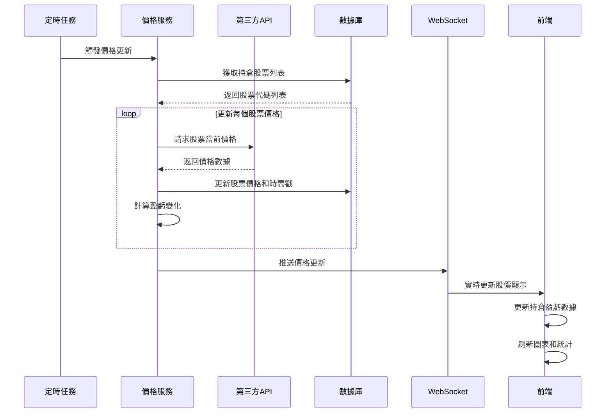
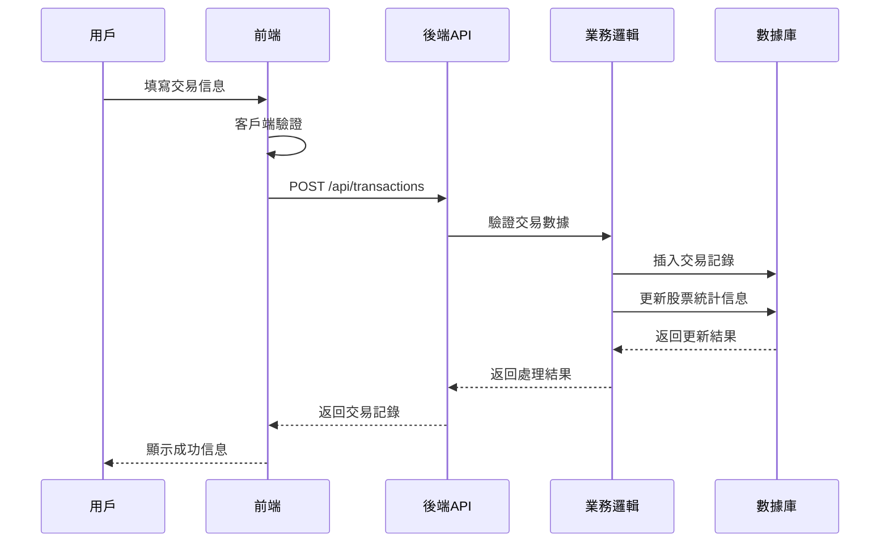
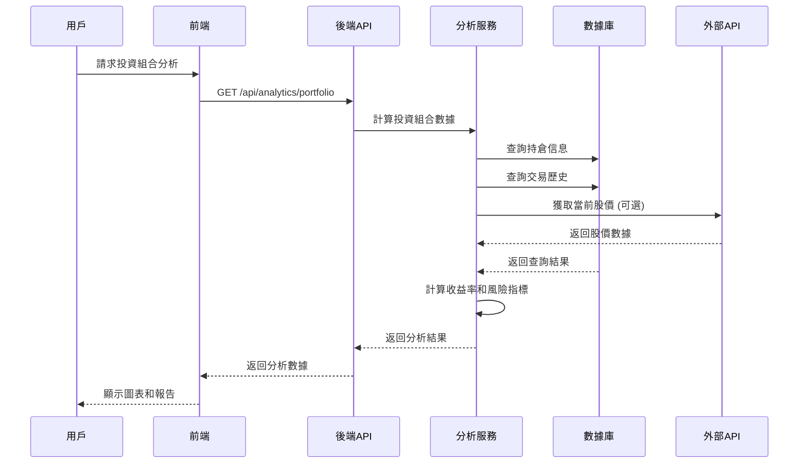

# 股票管理系統設計文檔

## 系統架構概述

本系統採用前後端分離的Web應用架構，專注於個人股票投資的日常管理需求，支持PC端和移動端使用。

### 核心功能模塊
1. **每日持倉概覽**: 實時顯示投資組合關鍵指標
2. **實時價格更新**: 自動獲取股票最新價格
3. **快速交易錄入**: 簡化的交易記錄輸入界面
4. **投資組合分析**: 收益分析和持倉分佈
5. **股息記錄管理**: 被動收入追蹤
6. **響應式設計**: PC和移動端適配

### 技術棧

**後端技術:**
- Python 3.8+
- Flask (Web框架)
- SQLAlchemy (ORM)
- SQLite (數據庫)
- Flask-CORS (跨域支持)
- APScheduler (定時任務)
- Requests (HTTP客戶端)

**前端技術:**
- Vue 3 (前端框架)
- Vue Router (路由管理)
- Pinia (狀態管理)
- Element Plus (UI組件庫)
- Chart.js (圖表庫)
- Axios (HTTP客戶端)
- Tailwind CSS (樣式框架)

**開發工具:**
- Vite (構建工具)
- ESLint (代碼檢查)
- Prettier (代碼格式化)
- PostCSS (CSS處理)

## 系統架構圖

```
┌─────────────────────────────────────────────────────────────────┐
│                        外部服務層                                │
│ ┌─────────────────┐    ┌─────────────────┐    ┌─────────────────┐ │
│ │   股價API       │    │   定時任務      │    │   價格緩存      │ │
│ │ (第三方數據源)   │───►│ (APScheduler)   │───►│   (內存/Redis)  │ │
│ └─────────────────┘    └─────────────────┘    └─────────────────┘ │
└─────────────────────────────────────────────────────────────────┘
                                   │
                                   ▼
┌─────────────────┐    ┌─────────────────┐    ┌─────────────────┐
│   前端 (Vue3)   │    │  後端 (Flask)   │    │ 數據庫 (SQLite) │
│                 │    │                 │    │                 │
│ ┌─────────────┐ │    │ ┌─────────────┐ │    │ ┌─────────────┐ │
│ │ 響應式界面  │ │    │ │  RESTful    │ │    │ │   stocks    │ │
│ │ PC/移動端   │ │    │ │  API路由    │ │    │ │             │ │
│ └─────────────┘ │    │ └─────────────┘ │    │ └─────────────┘ │
│ ┌─────────────┐ │    │ ┌─────────────┐ │    │ ┌─────────────┐ │
│ │ 狀態管理    │ │◄──►│ │ 業務邏輯    │ │◄──►│ │transactions │ │
│ │ (Pinia)     │ │    │ │ 計算服務    │ │    │ │             │ │
│ └─────────────┘ │    │ └─────────────┘ │    │ └─────────────┘ │
│ ┌─────────────┐ │    │ ┌─────────────┐ │    │ ┌─────────────┐ │
│ │ HTTP客戶端  │ │    │ │ 數據訪問    │ │    │ │  dividends  │ │
│ │ (Axios)     │ │    │ │ (SQLAlchemy)│ │    │ │             │ │
│ └─────────────┘ │    │ └─────────────┘ │    │ └─────────────┘ │
└─────────────────┘    └─────────────────┘    └─────────────────┘
```

## 數據庫設計

### 實體關係圖 (ERD)

```
┌─────────────────┐
│     stocks      │
├─────────────────┤
│ stock_code (PK) │
│ stock_name      │
│ market          │
│ currency        │
│ current_price   │
│ price_update_time│
│ total_shares    │
│ avg_cost        │
│ created_at      │
│ updated_at      │
└─────────────────┘
         │
         │ 1:N
         ▼
┌─────────────────┐
│  transactions   │
├─────────────────┤
│ id (PK)         │
│ stock_code (FK) │
│ transaction_type│
│ transaction_date│
│ price           │
│ shares          │
│ total_amount    │
│ commission      │
│ notes           │
│ created_at      │
└─────────────────┘
         
┌─────────────────┐
│   dividends     │
├─────────────────┤
│ id (PK)         │
│ stock_code (FK) │
│ dividend_date   │
│ dividend_per_share│
│ total_dividend  │
│ tax_amount      │
│ net_dividend    │
│ currency        │
│ notes           │
│ created_at      │
└─────────────────┘
```

### 數據表詳細設計

#### stocks 表
```sql
CREATE TABLE stocks (
    stock_code VARCHAR(20) PRIMARY KEY COMMENT '股票代碼',
    stock_name VARCHAR(100) NOT NULL COMMENT '股票名稱',
    market ENUM('SZ', 'SH', 'HK', 'US') NOT NULL COMMENT '市場類型',
    currency ENUM('CNY', 'HKD', 'USD') DEFAULT 'CNY' COMMENT '交易幣種',
    current_price DECIMAL(10,4) DEFAULT 0 COMMENT '當前價格',
    price_update_time DATETIME COMMENT '價格更新時間',
    total_shares DECIMAL(15,4) DEFAULT 0 COMMENT '總持股數',
    avg_cost DECIMAL(10,4) DEFAULT 0 COMMENT '平均成本價',
    created_at DATETIME DEFAULT CURRENT_TIMESTAMP COMMENT '創建時間',
    updated_at DATETIME DEFAULT CURRENT_TIMESTAMP ON UPDATE CURRENT_TIMESTAMP COMMENT '更新時間'
);
```

#### transactions 表
```sql
CREATE TABLE transactions (
    id INT AUTO_INCREMENT PRIMARY KEY COMMENT '交易ID',
    stock_code VARCHAR(20) NOT NULL COMMENT '股票代碼',
    transaction_type ENUM('BUY', 'SELL') NOT NULL COMMENT '交易類型',
    transaction_date DATE NOT NULL COMMENT '交易日期',
    price DECIMAL(10,4) NOT NULL COMMENT '交易價格',
    shares DECIMAL(15,4) NOT NULL COMMENT '交易股數',
    total_amount DECIMAL(15,2) NOT NULL COMMENT '交易總額',
    commission DECIMAL(10,2) DEFAULT 0 COMMENT '手續費',
    notes TEXT COMMENT '備註',
    created_at DATETIME DEFAULT CURRENT_TIMESTAMP COMMENT '記錄創建時間',
    FOREIGN KEY (stock_code) REFERENCES stocks(stock_code) ON DELETE CASCADE
);
```

#### dividends 表
```sql
CREATE TABLE dividends (
    id INT AUTO_INCREMENT PRIMARY KEY COMMENT '股息ID',
    stock_code VARCHAR(20) NOT NULL COMMENT '股票代碼',
    dividend_date DATE NOT NULL COMMENT '股息發放日期',
    dividend_per_share DECIMAL(10,4) NOT NULL COMMENT '每股股息',
    total_dividend DECIMAL(15,2) NOT NULL COMMENT '總股息金額',
    tax_amount DECIMAL(10,2) DEFAULT 0 COMMENT '稅額',
    net_dividend DECIMAL(15,2) NOT NULL COMMENT '稅後股息',
    currency ENUM('CNY', 'HKD', 'USD') DEFAULT 'CNY' COMMENT '股息幣種',
    notes TEXT COMMENT '備註',
    created_at DATETIME DEFAULT CURRENT_TIMESTAMP COMMENT '記錄創建時間',
    FOREIGN KEY (stock_code) REFERENCES stocks(stock_code) ON DELETE CASCADE
);
```

## API設計

### RESTful API 端點

#### 股票管理 API
```
GET    /api/stocks                    # 獲取所有股票列表
GET    /api/stocks/{stock_code}       # 獲取特定股票詳情
POST   /api/stocks                    # 創建新股票記錄
PUT    /api/stocks/{stock_code}       # 更新股票信息
DELETE /api/stocks/{stock_code}       # 刪除股票記錄
GET    /api/stocks/search             # 股票代碼搜索和自動補全
```

#### 實時價格 API
```
GET    /api/prices/current            # 獲取所有持倉股票當前價格
GET    /api/prices/{stock_code}       # 獲取特定股票當前價格
POST   /api/prices/refresh            # 手動刷新股票價格
GET    /api/prices/status             # 獲取價格更新狀態和時間
```

#### 交易記錄 API
```
GET    /api/transactions              # 獲取所有交易記錄
GET    /api/transactions/{id}         # 獲取特定交易記錄
GET    /api/stocks/{stock_code}/transactions # 獲取特定股票的交易記錄
POST   /api/transactions              # 創建新交易記錄
PUT    /api/transactions/{id}         # 更新交易記錄
DELETE /api/transactions/{id}         # 刪除交易記錄
```

#### 股息記錄 API
```
GET    /api/dividends                 # 獲取所有股息記錄
GET    /api/dividends/{id}            # 獲取特定股息記錄
GET    /api/stocks/{stock_code}/dividends # 獲取特定股票的股息記錄
POST   /api/dividends                 # 創建新股息記錄
PUT    /api/dividends/{id}            # 更新股息記錄
DELETE /api/dividends/{id}            # 刪除股息記錄
```

#### 投資組合分析 API
```
GET    /api/portfolio/overview        # 獲取投資組合概覽
GET    /api/portfolio/performance     # 獲取投資表現分析
GET    /api/portfolio/distribution    # 獲取持倉分佈分析
GET    /api/portfolio/daily-summary   # 獲取每日盈虧摘要
```

#### 移動端優化 API
```
GET    /api/mobile/dashboard          # 移動端儀表板數據
GET    /api/mobile/quick-actions      # 快速操作選項
POST   /api/mobile/quick-transaction  # 快速交易錄入
```

## 核心服務設計

### 業務服務層

#### 1. 股價更新服務 (PriceUpdateService)
```python
class PriceUpdateService:
    def __init__(self, api_client, cache_manager):
        self.api_client = api_client
        self.cache_manager = cache_manager
    
    def update_all_prices(self) -> Dict:
        """更新所有持倉股票價格"""
        pass
    
    def update_single_price(self, stock_code: str) -> Dict:
        """更新單個股票價格"""
        pass
    
    def get_market_status(self) -> str:
        """獲取市場開盤狀態"""
        pass
    
    def schedule_price_updates(self):
        """設置定時價格更新任務"""
        pass
```

#### 2. 投資組合計算服務 (PortfolioCalculator)
```python
class PortfolioCalculator:
    def calculate_portfolio_summary(self, user_stocks: List) -> Dict:
        """計算投資組合概覽數據"""
        pass
    
    def calculate_daily_profit_loss(self, stocks: List) -> Dict:
        """計算當日盈虧"""
        pass
    
    def calculate_position_distribution(self, stocks: List) -> List:
        """計算持倉分佈"""
        pass
    
    def update_avg_cost(self, stock_code: str, transactions: List) -> float:
        """更新平均成本價"""
        pass
```

#### 3. 移動端適配服務 (MobileAdapterService)
```python
class MobileAdapterService:
    def get_dashboard_data(self) -> Dict:
        """獲取移動端儀表板數據"""
        pass
    
    def get_simplified_portfolio(self) -> List:
        """獲取簡化的持倉列表"""
        pass
    
    def format_quick_actions(self) -> List:
        """格式化快速操作選項"""
        pass
```

### 數據處理流程

1. **實時價格更新流程**
   - 定時任務觸發價格更新
   - 調用第三方API獲取最新價格
   - 更新數據庫中的股票價格
   - 計算並更新投資組合數據
   - 推送更新到前端

2. **交易記錄處理流程**
   - 用戶提交交易記錄
   - 驗證交易數據完整性
   - 保存交易記錄到數據庫
   - 自動重新計算平均成本價
   - 更新持股數量
   - 刷新投資組合統計

3. **移動端數據適配流程**
   - 檢測客戶端設備類型
   - 根據屏幕尺寸調整數據格式
   - 簡化複雜數據結構
   - 優化圖片和圖表大小
   - 返回適配後的數據

### 錯誤處理策略

- **API調用失敗**: 使用緩存數據，記錄錯誤日誌
- **數據驗證錯誤**: 返回詳細錯誤信息，阻止操作
- **計算錯誤**: 使用默認值，記錄警告
- **網絡異常**: 提供離線模式，數據同步

## 序列圖

### 實時價格更新流程



### 交易記錄添加流程



### 投資組合分析查詢流程



## 前端組件設計

### 組件層次結構

```
App.vue
├── Header.vue (導航欄)
├── Sidebar.vue (側邊欄)
└── Router View
    ├── Dashboard.vue (儀表板)
    │   ├── PortfolioSummary.vue
    │   ├── RecentTransactions.vue
    │   └── PerformanceChart.vue
    ├── StockList.vue (股票列表)
    │   ├── StockCard.vue
    │   └── StockFilter.vue
    ├── TransactionList.vue (交易記錄)
    │   ├── TransactionForm.vue
    │   └── TransactionTable.vue
    ├── DividendList.vue (股息記錄)
    │   ├── DividendForm.vue
    │   └── DividendTable.vue
    ├── Analytics.vue (分析報告)
    │   ├── PortfolioChart.vue
    │   ├── PerformanceChart.vue
    │   └── DividendChart.vue
    └── Settings.vue (設置)
        ├── ImportExport.vue
        └── UserPreferences.vue
```

### 狀態管理 (Pinia)

```javascript
// stores/stocks.js
export const useStocksStore = defineStore('stocks', {
  state: () => ({
    stocks: [],
    currentStock: null,
    loading: false,
    error: null
  }),
  actions: {
    async fetchStocks(),
    async createStock(stockData),
    async updateStock(stockId, stockData),
    async deleteStock(stockId)
  }
})

// stores/transactions.js
export const useTransactionsStore = defineStore('transactions', {
  state: () => ({
    transactions: [],
    loading: false,
    error: null
  }),
  actions: {
    async fetchTransactions(stockId),
    async createTransaction(transactionData),
    async updateTransaction(transactionId, transactionData),
    async deleteTransaction(transactionId)
  }
})
```

## 安全考慮

### 數據驗證
- 前端和後端雙重數據驗證
- SQL注入防護 (使用參數化查詢)
- 文件上傳類型和大小限制
- XSS攻擊防護

### 錯誤處理
- 統一的錯誤響應格式
- 詳細的日誌記錄
- 用戶友好的錯誤信息
- 異常情況的優雅降級

## 性能優化

### 數據庫優化
- 適當的索引設計
- 查詢優化
- 連接池管理
- 數據分頁

### 前端優化
- 組件懶加載
- 圖片壓縮和懶加載
- HTTP請求緩存
- 虛擬滾動 (大數據列表)

### 緩存策略
- 瀏覽器緩存
- API響應緩存
- 靜態資源CDN

## 部署架構

### 開發環境
```
┌─────────────────┐    ┌─────────────────┐
│   前端開發服務器  │    │   後端開發服務器  │
│   (Vite)        │    │   (Flask)       │
│   localhost:3000│◄──►│   localhost:5001│
└─────────────────┘    └─────────────────┘
                              │
                              ▼
                       ┌─────────────────┐
                       │   SQLite文件    │
                       │   (本地存儲)     │
                       └─────────────────┘
```

### 生產環境
```
┌─────────────────┐    ┌─────────────────┐    ┌─────────────────┐
│   Nginx         │    │   Gunicorn      │    │   SQLite        │
│   (靜態文件服務) │    │   (WSGI服務器)  │    │   (數據庫)      │
│   Port 80/443   │◄──►│   Port 5000     │◄──►│   文件系統      │
└─────────────────┘    └─────────────────┘    └─────────────────┘
```

## 監控和日誌

### 日誌記錄
- 應用程序日誌 (Flask logging)
- 錯誤日誌 (異常追蹤)
- 訪問日誌 (Nginx)
- 性能日誌 (響應時間)

### 監控指標
- 系統資源使用率
- API響應時間
- 錯誤率統計
- 用戶活躍度

## 擴展性考慮

### 未來功能擴展
- 多用戶支持
- 實時股價更新
- 移動端應用
- 第三方API集成
- 高級分析功能

### 技術債務管理
- 代碼重構計劃
- 依賴更新策略
- 性能優化路線圖
- 安全更新流程